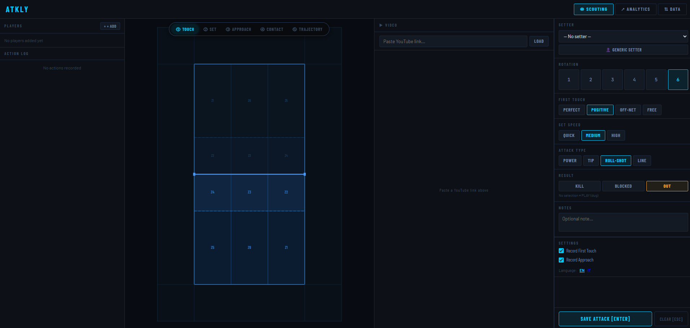
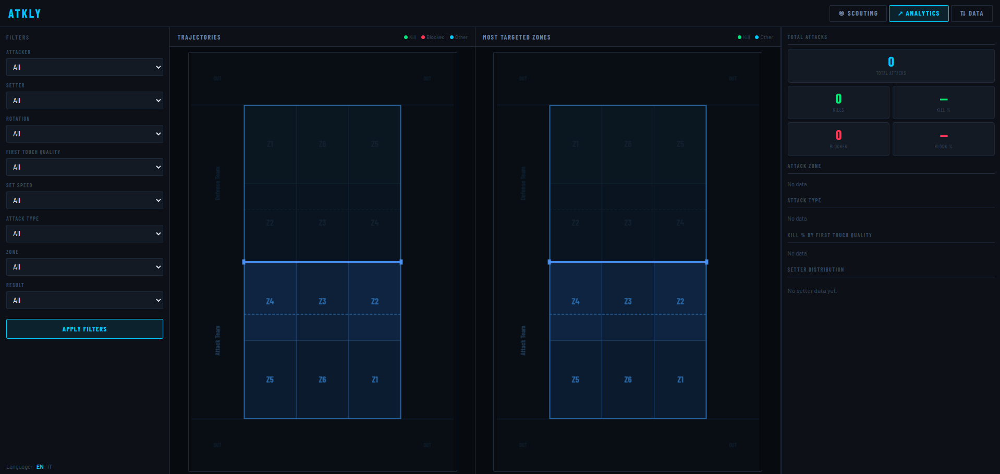

# Atkly

A local desktop application for scouting and analysing volleyball attack sequences.
Record attacks point-by-point during a match, then explore the data in the analytics
dashboard with heatmaps, zone breakdowns, and kill-rate charts.

---

## Screenshots

| Scouting view | Analytics dashboard |
|---|---|
|  |  |

---

## Features

- **Interactive court diagram** — click to record pass, set, approach, contact, and trajectory
- **Attack tagging** — first-touch type, set speed, attack type, rotation, zone (auto-detected)
- **Player roster** — add players with role and height
- **Analytics dashboard** — kill %, block %, zone distribution, first-touch → kill correlations, setter breakdown
- **CSV import / export** — transfer data between installations or share with analysts
- **Database backup / restore** — download and restore the SQLite file directly from the UI
- **Multi-language UI** — English and Italian, switchable at runtime
- **Desktop launcher** — one command to start; opens the browser automatically

---

## Requirements

- Python 3.11 or newer

---

## Installation

```bash
git clone https://github.com/your-org/atkly.git
cd atkly

# Create and activate a virtual environment
python -m venv .venv
source .venv/bin/activate        # macOS / Linux
.venv\Scripts\activate.bat       # Windows

pip install -r requirements.txt
```

---

## Usage

**Recommended — opens the browser automatically:**

```bash
python launcher.py
```

**Alternative — plain Flask server on port 5000:**

```bash
python run.py
# Then open http://127.0.0.1:5000 in your browser
```

---

## Language

The UI supports **English** and **Italian**.
Switch language from the Settings panel in the scouting view, or from the language
selector on the Analytics and Data pages.

---

## Data

All data is stored locally in `instance/database.db` (SQLite, created automatically on first run).
No internet connection is required.

Back up `instance/database.db` to preserve your data between reinstalls, or use the
**Restore Database** option on the Data page.

---

## Import / Export

Use the **Data** tab in the app, or call the endpoints directly.

### Export

| Endpoint | Description |
|---|---|
| `GET /data/export/players` | Download all players as CSV |
| `GET /data/export/attacks` | Download all attacks as CSV |
| `GET /data/export/db` | Download the full SQLite database |

### Import

| Endpoint | Method | Description |
|---|---|---|
| `/data/import/players` | `POST` | Upload a players CSV (`file` field) |
| `/data/import/attacks` | `POST` | Upload an attacks CSV (`file` field) |
| `/data/import/db` | `POST` | Restore a full SQLite backup (`file` field) |

**Import rules:**
- Files must be UTF-8 encoded (Excel BOM is handled automatically).
- Malformed rows are skipped and reported in the JSON response.
- Import players before attacks — attacks are matched by jersey number + surname.

```bash
curl -F "file=@players_export.csv" http://127.0.0.1:5000/data/import/players
curl -F "file=@attacks_export.csv" http://127.0.0.1:5000/data/import/attacks
```

---

## Building a Standalone Executable

```bash
pip install pyinstaller
python build_release.py          # onedir build → dist/atkly/
python build_release.py --clean  # clean build/ and dist/ first
```

The `dist/atkly/` folder is self-contained and can be run on any machine without Python installed.

---

## Project Structure

```
atkly/
├── app/
│   ├── __init__.py          # App factory and localization setup
│   ├── models/              # SQLAlchemy models (Player, Attack)
│   ├── routes/
│   │   ├── main.py          # Index and scouting page
│   │   ├── players.py       # Player CRUD API
│   │   ├── attacks.py       # Attack scouting API
│   │   ├── analytics.py     # Dashboard data API
│   │   └── importexport.py  # CSV and database import/export
│   ├── utils/
│   │   └── court.py         # Zone detection and coordinate helpers
│   ├── static/              # CSS and JavaScript
│   └── templates/           # Jinja2 HTML templates
├── locales/
│   ├── en.json              # English UI strings
│   └── it.json              # Italian UI strings
├── .github/
│   └── workflows/
│       └── release.yml      # Automated cross-platform release CI
├── docs/img/                # Screenshot assets
├── instance/                # Database files (git-ignored)
├── atkly.spec               # PyInstaller build specification
├── build_release.py         # Release build helper
├── launcher.py              # Desktop launcher (auto-opens browser)
├── run.py                   # Direct Flask entry point
├── requirements.txt         # Runtime dependencies
└── requirements-build.txt   # Build-time dependencies
```

---

## Troubleshooting

**App won't start**
Run `pip install -r requirements.txt` to ensure all dependencies are installed.

**Browser doesn't open automatically**
The URL is printed in the terminal — paste it into your browser manually.

**Port already in use**
`launcher.py` selects a free port automatically. If using `run.py` directly, override the port:
```bash
FLASK_RUN_PORT=5001 python run.py
```

**Data missing after reinstall**
Copy `instance/database.db` from the old installation into the new `instance/` folder,
or use the **Restore Database** option on the Data page.

**Schema errors after update**
The app applies SQLite migrations automatically on startup — existing data is always preserved.

**Import errors: "player not found"**
Attacks are matched to players by jersey number + surname. Import the players CSV first.

---

## Contributing

Pull requests and issues are welcome. Please open an issue to discuss significant changes before submitting a PR.

---

## License

See [LICENSE](LICENSE).
